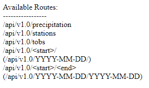

# Hawaii Weather: Simulated API and Flask App

## Overview

This project explores the use of the SQLAlchemy and Flask Python libraries by accessing a simulated weather database API and constructing a basic dashboard app.

The jupyter notebook explores the use of SQLAlchemy in accessing the 'database' and provides the templates for constructing the Flask routes.

The home route of the Flask app lists all static routes as well as the format for variable routes.

## Tools Used

Python

SQLAlchemy

Matplotlib Pyplot

Flask

# Code Walkthrough

  
Click to expand!

The project code consists of two primary components: a jupyter notebook running a Python3 kernel and a Python script containing instructions for a Flask App.

## Climate Analysis and Exploration

Jupyter Notebook: https://github.com/kellnergp/sqlalchemy-challenge/blob/main/climate_gpk.ipynb

Create a Jupyter Notebook file and import dependencies, including matplotlib.pyplot, pandas, datetime, and SQLAlchemy.

Use SQLAlchemy.create_engine to connect to the hawaii.sqlite database.

Use SQLAlchemy automap_base() to reflect the tables from the database into classes and save a reference to those classes called Station and Measurement.

Use SQLAlchemy.inspect to get the column names and object types for each table.

Create a session link to the database with the SQLAlchemy Session() function.

### Precipitation Analysis

Find the most recent date in the Measurement table with a session.query for func.max(Measurement.date) and save the result.

Convert the date to a datetime object with the datetime.datetime.strptime() function.

Calculate the date on year prior to the end of the dataset by subtracting datetime.timedelta(days=365) from the most recent date.

Perform a session query (1) for the 'date' and 'prcp' columns from Measurement table, filtering for dates greater than or equal to the calculated start date.

Save the query results into a list with a list comprehension then use the list to form a Pandas dataframe.

Convert the dataframe's 'Data' column to datetime format with the appropriate function.

Set the 'Date' column as the index and sort the dataframe by 'Date'.

Use the Pandas plot() function to generate a plot of the precipiation values over time.

Finally, use the Pandas describe() function to print the summary statistics for the precipitation data.

### Station Analysis

Use a session query to determine the number of stations in the dataset by calling the 'station' column from the Station table, grouping by 'station', and using the count() function.

Create a query (2) to find the most active station by calling Station.station and func.count(Measurement.id), joining the tables on 'station', grouping by 'station', and sorting by the func.count(), descending.

Save the top result's station.

Query (3) func.min(), func.max(), and func.avg() for the 'tobs' column from the Measurement table, filtering for rows where the 'station' is equal to the saved station.

Using the start date from the previous section and the saved station from this section as filters, query 'tobs' data from the Measurement table.

Save the results of the query into a list with a list comprehension then use the list to generate a Pandas dataframe.

Use the Pandas plot().hist() function to create a graph of temperature frequency within the query results, using 12 bins.

Close the session before continuing to the next section.

## Climate App

App Code: https://github.com/kellnergp/sqlalchemy-challenge/blob/main/app.py

Import Flask as well as all dependencies from the Notebook section.

Follow the same steps as the Notebook section to establish a connection to the database, reflect the tables, and save references to them.

Create a series of routes to hold various queries from the database.

### '/' Route

Establish a home route with flask.

Use flask.escape() function to render the \<start> and \<end> components of the final routes printable strings.

Return a list of all available routes.

### '/api/v1.0/precipitation' Route

Establish a route to return the results of the precipitation query from the Notebook section.

Create a session link to the database with the SQLAlchemy Session() function.

Repeat the steps to generate query (1) and save the results into a list.

Use a for loop to save the results into a dictionary, with the 'date' as key and 'prcp' as value.

Close the session and return the dictionary in jsonified form.

### '/api/v1.0/stations' Route

Use flask syntax to create a route for a 'stations' query.

Create a session link to the database with the SQLAlchemy Session() function.

Use a session query of Station.station and Station.name to find all stations within the dataset.

Generate a list of 'station identifier':'station name' pairs using a list comprehension.

Close the session and return a jsonified version of the list.

### '/api/v1.0/tobs' Route

Establish a route for a 'tobs' query of the most active station for the last year of data using flask.

Create a session link to the database with the SQLAlchemy Session() function.

Follow the steps from query (2) to determine the most active station and save the result.

Repeat the steps from the Precipitation Analysis section to find the start date for the last year of data.

Query Measurement.date and Measurement.tobs, filtering for date greater than or equal to the start date and for station matching the saved station.

Use a for loop to save the results of the query in the form of a list of 'date':'tobs' pairs.

Close the session and return the list in jsonified form.

### '/api/v1.0/\<start>/' Route and '/api/v1.0/\<start>/\<end> ' Route

Establish routes for \<start> and \<start>/\<end> routes with both routes calling the same function.

Define the temp() function to have start and end as inputs, with end having a default value of 'None'.

The routes and function may only accept inputs in the format of 'YYYY-MM-DD'.

Create a session link to the database with the SQLAlchemy Session() function.

Use a conditional statement with a condition of end not equal to None.

Within the if statement, convert start and end to datetime objects with the format '%Y-%m-%d'.

Query func.min(), func.avg(), and func.max() for Measurement.tobs, filtering for Measurement.date greater than or equal to start date and Measurement.date less than or equal to the end date, and save the results as temp_results.

Within an else statement, convert start to a datetime object with the format '%Y-%m-%d'.

Query func.min(), func.avg(), and func.max() for Measurement.tobs, filtering for Measurement.date greater than or equal to start date, and save the results as temp_results.

After the conditional statements, store the results in a list object as key-value pairs with the keys being 'TMIN', 'TAVG', and 'TMAX' and the values being the corresponding query results.

  

  
  ## Contact
  
  Galen Kellner: kellnergp@gmail.com
Close the session and return the list in jsonified form.
